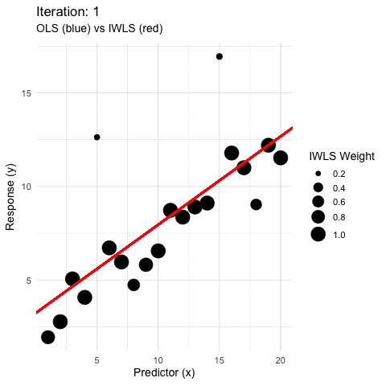
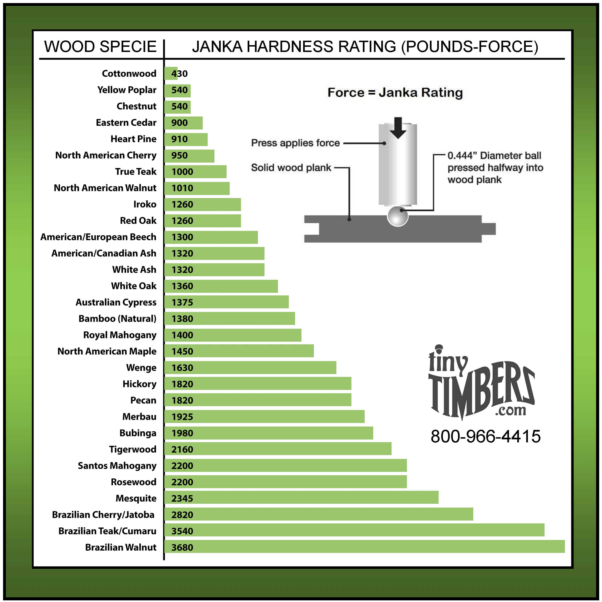
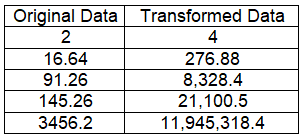
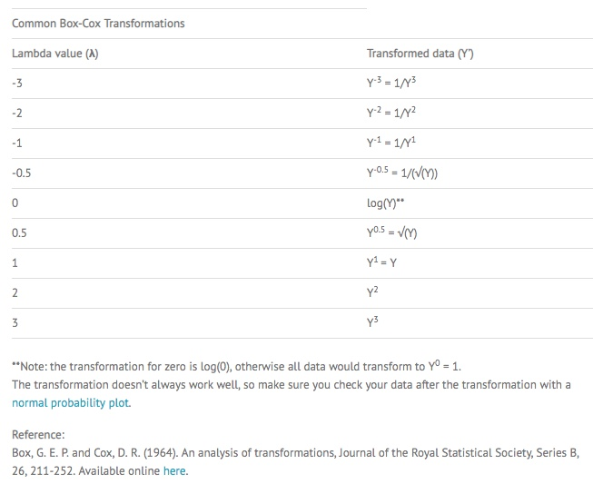
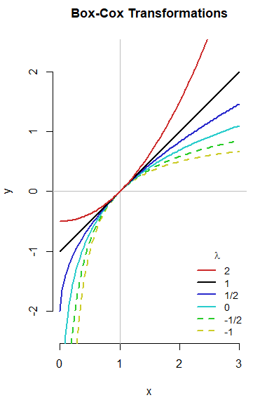
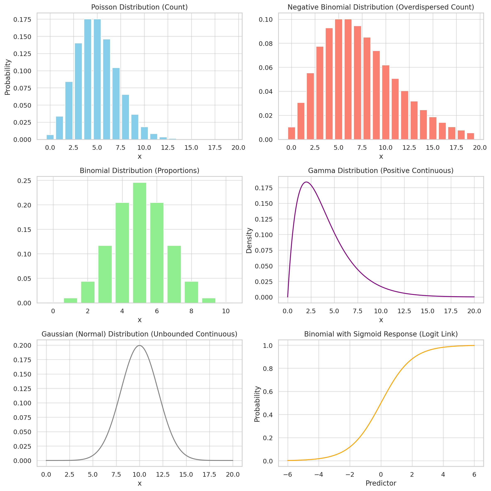
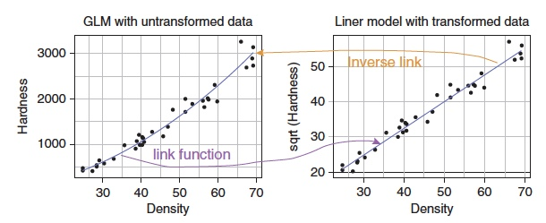
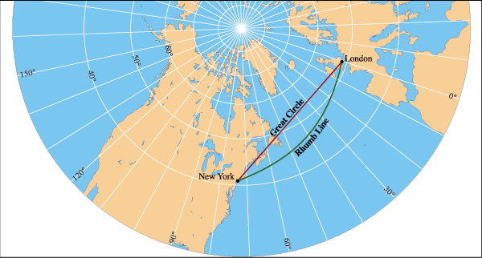
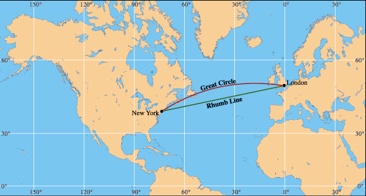

```{r setup2, include=FALSE}
knitr::opts_chunk$set(echo = TRUE)
packages_needed <- c("GLMsData", # janka hardness data
                     "ggplot2", # graphics
                     "MASS", # Box-Cox
                     "arm", # display() etc.
                     "ggfortify", # check model assumptions
                     "easystats", #check model assumptions
                     "patchwork"
                     )
pk_to_install <- packages_needed [!( packages_needed %in% rownames(installed.packages())  )]
if(length(pk_to_install)>0 ){
  install.packages(pk_to_install,repos="http://cran.r-project.org")
}
#lapply(packages_needed, require, character.only = TRUE)
library("GLMsData")
library("ggplot2")
library("MASS")
library("arm")
library("ggfortify")
library("easystats")
library("patchwork")
```

\
**What is Maximum Likelihood?**

-   Given a set of data and statistical model, find the values of the parameters that are most likely to reproduce the data; those that "find the best fit"

-   Remember that we have seen this before in a different context; **Ordinary Least Squares (OLS)** Regression finds the single-best line of fit that minimizes the sum of the squared differences; works for normal data

-   OLS doesn't work with data having other distributions; binomial is obvious example

-   Maximum likelihood provides a more general approach that applies to a broader range of data (hence 'generalized')

-   The method that underlies GLMs is called **Iterative Weighted Least Squares**

-   Where OLS has exactly one best solution for model fit, ML methods are *iterative* and *approximate*.
    Essentially we try out many potential lines of best fit using algorithms and gradually home in on what looks like the best solution.
<br>
<br>
<center>

</center>
<br>
<br>

-   To avoid very small numbers the calculations are done with the (natural) log-likelihood (calculations that are multiplicative on the likelihood scale become additive with log-likelihoods).

-   The generalized version of SS (sums of squares) is called the **deviance**.
    Deviance is defined in terms of comparing pairs of models where one is more complex and the other a simplified version (as done in R using the `anova()` function).

-   Deviance is twice the difference in the log-likelihoods of the more complex and simplified models (expressed as a negative value).

-   Deviance approximately follows the chi-square distribution (with DF equal to the number of parameters of the model), which allows the calculation of levels of probability and confidence, just as the normal distribution does when using normal least squares.

```{r janka linear model}
#janka is pronounced 'Yangka'
data(janka) # load data
names(janka) <- c("Density", "Hardness") # assign full names
janka # Box 4.1
```

**OLS Example:**

The Janka hardness test, created by Austrian-born American researcher Gabriel Janka (1864–1932), measures the resistance of a sample of wood to denting and wear. It measures the force required to embed a .44 in steel ball halfway into a sample of wood. This ball diameter was chosen to produce a circle with an area of 100 square millimeters, or one square centimeter.

A common use of Janka hardness ratings is to determine whether a species is suitable for use as flooring.


<br>
<br>
Based on the sampled species above it looks like the hardest Brazilian hardwoods are much harder than you might expect based on their ordering. The pattern looks 'non-linear' and almost seems exponential at the bottom (hardest) end. 
<br>
<br>
```{r janka model plot, message=FALSE, warning=FALSE}
#Timber hardness measured on the 'Janka' scale
plot_ols <-
  ggplot(janka, aes(x=Density, y=Hardness)) + 
  geom_point()+
  geom_smooth(method=lm, se=FALSE) +
  geom_smooth(color = "orange", se = FALSE) +
  ggtitle("Fiber density vs. wood hardness")

plot_ols

## Normal least squares linear regression using lm(): 
janka.ls1 <- lm(Hardness~Density, data = janka)
```

Check assumptions for fitting a linear model.
I suggest a way better than the `autoplot` function in `ggfortify` that we have used before.

```{r check lm assumptions, message=FALSE, warning=FALSE, fig.height=7, fig.width=9}
performance::check_model(janka.ls1) #easystats package
```

There are two very subtle problems with the OLS model:
-  there is some curvature in the relationship that is not captured using the `lm` specification
-  the variance is not constant; it increases with the mean

One way to deal with these issue is to transform the response variable. But how should be transform the response? What mathematical function should be use? 

Another way is to deal with these issues is to perform the transformation directly within the linear model specification (we will do this later using a GLM).

**Maximum Likelihood to find best transformation:**

Figure 8.1 A likelihood surface for the Box--Cox function applied to the simple linear regression of the Janka wood hardness data.

Box Cox transformations are done by raising each point of the response variable (y) to a power (lambda, $\lambda$) that is systematically varied. For example, when $\lambda$=2, the data are squared, when $\lambda$=0.5 they are square rooted, and so on. In Box-Cox transformations, only the response variable 
(y) is transformed to improve model assumptions, while the predictor variables (x) remain unchanged.

```{r janka box cox}
boxcox(janka.ls1) #see linear regression for janka.ls1
```

The peak $\lambda$ (transformation value) looks to be around 0.5 with confidence intervals definitely spanning 0.5. 

The R output for the `boxcox()` function plots the maximum likelihood surface (the curve) together with a maximum likelihood-based 95% CI.

The 95% CI is produced by dropping down 1.92 log-likelihood units from the maximum likelihood value, moving horizontally left and right (the dotted line labelled 95% in Fig. 8.1) until the likelihood surface is met and then dropping down from these points as shown by the outer vertical dotted lines in the same figure.
The value of 1.92 derives from the critical value of chi-squared (deviance, the generalized equivalent of SS, is distributed approximately following chi-square) with 1 DF and at the P \< 0.05 level of confidence in question, divided by two (for a two-tailed test).

**So how do we interpret $\lambda$?**

Any number raised to the power of **zero** equals one, a special behavior is defined that integrates smoothly with the other transformations: $\lambda$=0 is the natural log transformation.

The data raised to the power **one** are untransformed.

If the lambda is **two** then y^1^ = y^2^ (each value is squared)

If the lambda is **three** then y^1^ = y^3^ (each value is cubed)

For negative values of lambda, we use the reciprocals.



\
\
The solid black line graphs the Box-Cox transformation for 𝜆=1, which is just 𝑥→𝑥−1.
It merely shifts the center of the batch to 0 (as do all the Box-Cox transformations).
The upward curving red line is for 𝜆=2.
The downward curving lines are in order of increasing curvature, the smaller values of 𝜆 down to −1.
\
\
The results of the Box--Cox transformation of Janka hardness data suggest that a value of lambda of around 0.5 will give the best fit to the data so we can proceed using the square-root transformation, or rather the GLM equivalent.\
Video explaining calculation of lambda: <https://www.youtube.com/watch?v=vGOpEpjz2Ks&t=678s>\
\

```{r plot sqrt transform, fig.width=8, message=FALSE, warning=FALSE}
#SQRT Timber hardness measured on the 'Janka' scale
plot_sqrt <-
  ggplot(janka, aes(x = Density, y = sqrt(Hardness))) +
  geom_point() +
  geom_smooth(method = lm, se = FALSE, formula = y ~ x, color = "green") +
  geom_smooth(color = "orange", se = FALSE) +
  ggtitle("Fiber density vs. (sqrt) wood hardness")

plot_ols + plot_sqrt #use patchwork to show figures side-by-side

```


We noted previously that another way is to deal with the curvature and non-constant variance issues is to perform the transformation directly within the linear model specification; We will do this using a GLM.

**Basics of Generalized Linear Models**\
\
The general form of the GLM is:

**glm**(formula, **family**=familytype(**link**=linkfunction), **data**=)\
\
GLMs were first proposed in an article by Nelder and Wedderburn in 1972 (J. R. Statist. Soc. A, 135: 370).
The 1983 book Generalized linear models by McCulloch and Nelder is the standard reference.

GLMs have three components:

-   a linear predictor

-   a variance function

-   a link function.

The first is the most familiar.
In R, the **linear predictor** is what comes after the tilde (\~) in our linear model formula.
In the Janka example above it is wood density.

The **variance function** models the variation in the data.
This is also familiar to us since OLS uses the normal distribution to model the residual variation.
The difference here is that GLMs are not restricted to the normal distribution but make use of a much wider range of distribution 'families' including the *poisson*, the *binomial*, and the *gamma*.

The third component is the least familiar.
The **link** function plays a role equivalent to the transformation in normal least squares models.
However, *rather than transforming the data we transform the predictions made by the linear predictor*.
Commonly used link functions include the *log*, *square root*, and *logistic*.

| **Response Type**         | **Distribution (Family)** | **Link Function** | **Typical Use**                  |
|---------------------------|---------------------------|-------------------|----------------------------------|
| Count                     | Poisson                   | Log               | Abundance, number of individuals |
| Overdispersed Count       | Negative Binomial         | Log               | Abundance with high variance     |
| Binary (presence/absence) | Binomial                  | Logit or Probit   | Species occurrence               |
| Proportions               | Binomial                  | Logit             | Survival rate, cover             |
| Continuous, positive      | Gamma                     | Log or Inverse    | Biomass, energetic rates         |
| Continuous, unbounded     | Gaussian                  | Identity          | Temperature, body size           |

: GLMs allow for response variables with non-normal distributions, making them flexible for ecological data. The choice of error structure (distribution + link function) depends on the type of response variable:



To see how this works, lets fit the Janka model using both OLS and GLM.

```{r janka OLS}
janka.ls1 <- lm(Hardness~Density, data= janka )
anova(janka.ls1)
```

We can fit the same model using the GLM function:

```{r janka GLM}
janka.ml1 <- glm(Hardness~Density, data= janka, family= gaussian(link="identity"))
anova(janka.ml1)
```

Notice in the model specification above, the *family=gaussian* and *link=identity* are the defaults.
Like other R code, we can omit specification of default parameters, but probably best to include them until we understand the models fully.

*Gaussian* is another word for 'normal'; the *identity* link is equivalent to performing no transformation, so no transformation is applied to the fitted values from the linear predictor.

Notice that when using the `anova()` function, we get different information for *lm* vs *glm* model specification.
ANOVA of the lm gives a least squares ANOVA table, whereas the glm gives a maximum likelihood analysis of deviance (ANODEV).
These outputs look more different than they actually are.

Recall that for GLMs using the normal (gaussian) distribution, the deviance is the SS (sum of squared residuals).
So the values for the deviance here (based on likelihood) match the conventional ANOVA table.
However, there is no equivalent of the means squares in the analysis of deviance.

Quick question: **What are mean squares used for? What do they tell us?**

The point here is to demonstrate that the `glm()` function with the Gaussian variance function and identity link performs the equivalent analysis to the `lm()` function we can see how to take fuller advantage of its greater flexibility.

**We need to model the mean and the variance.** We know that in the normal least squares analysis for the Janka data, the best fit was produced by the square-root transformation, as recommended by the Box--Cox results.
However, with this transformation the variance increased as the mean increased (slightly).\

\
We can have the best of both worlds in our GLM by using a square-root link function in combination with a distribution in which the variance increases with the mean.
It turns out that for the gamma distribution the variance increases as the square of the mean.
We can fit a GLM with a square-root link and gamma distribution variance function as follows:

```{r gamma link function}
janka.gamma <- glm(Hardness~Density, data= janka, family=Gamma(link= "sqrt"))
#summary(janka.gamma)

ggplot(janka,aes(Density,Hardness)) + 
  geom_point() +
  geom_smooth(method="glm",colour="red",
                         method.args=list(family="Gamma"(link="sqrt")))+
  labs(title="GLM, square-root link, Gamma variance")
```

\
Figure 8.3 might help relate the GLM approach using a link function to the linear model analysis of the square-root transformed data.

-   To recap, the untransformed data (left-hand panel) show that the positive linear relationship has some upward curvature with increasing scatter.
    The linear regression of the square-root transformed data (right panel) linearizes the relationship by reducing the larger values more in absolute terms than the smaller values.

-   In contrast, the GLM (right-hand panel) uses a square-root link function to transform the linear relationship on the square-root scale into an upward-bending curve through the middle of the untransformed data.

-   The increasing variability is handled separately in the GLM by the gamma distribution variance function.
    The link function (and its opposite the inverse link function) map the straight line from the linear model and the curve from the GLM onto each other.

We can get CIs for the regression intercept and slope (remember the curve in the figures is linear on the scale of the link function, the square root in this case):

```{r message=FALSE, warning=FALSE}
coef(janka.gamma)
confint(janka.gamma)
```

Since confidence intervals are not based on the normal distribution, they are not constrained to be symmetric.
However, they are interpreted in the same way.\

\
So how do we tell which model is better, one fit vis OLS or one fit via maximum likelihood?

```{r compare glm models}
model_comp <- performance::compare_performance(janka.ls1, janka.gamma)
print_md(model_comp)
```

While comparing these indices is often useful, making a decision (for instance, which model to keep or drop) can often be hard, as the indices can give conflicting suggestions.
Additionally, it is sometimes unclear which index to favor in the given context.

**Summary**

-   A simple normal least squares linear regression failed to capture the curvature in the relationship and infringed the assumption of approximately equal variability around the regression line: as is often the case the variance increases with the mean.

-   A square-root transformation of the Janka wood hardness data produces a linear relationship but the variability is still unequal.
    In contrast, log transformation equalizes the variability but generates its own curvature.

-   Instead we use a more flexible GLM approach that can model the mean and variability independently.

-   GLMs based on maximum likelihood use a link function to model the mean (in this case a square-root link) and a variance function to model the variability (in this case the gamma distribution where the variance increases as the square of the mean).

-   Interpretability matters: Sometimes a slightly worse-fitting model may be more biologically interpretable.

\
\
\
\
\
\
Visual Explanation of Maximum Likelihood:

<https://www.youtube.com/watch?v=XepXtl9YKwc>

Maximum likelihood vs least squares in linear regression

<https://www.youtube.com/watch?v=bhTIpGtWtzQ>

Box-Cox:

<https://www.statisticshowto.datasciencecentral.com/box-cox-transformation/>

Analogy to help logically interpret link functions:

-   Just as pilots follow great-circle routes that look curved on maps but are straight in 3D, GLMs use link functions to keep modeling “straight” (linear) while honoring constraints.

-   This analogy isn't standard in textbooks, but it captures the geometric beauty of GLMs and helps internalize why the link function exists.

 
